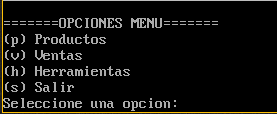

# Manual de Usuario

# Tabla de Contenido

- [Sobre el Programa](#overview)
- [Menu Principal](#main-menu)
  - [Menu Productos](#products-menu)
    - [Crear Producto](#create-prod)
    - [Eliminar Producto](#delete-prod)
    - [Ver Productos](#view-products)
  - [Ventas](#sales-menu)
  - [Herramientas](#tools-menu)
    - [Generar Catalogo](#catalog)
    - [Generar Alfabetico](#rep-al)
    - [Reporte de Ventas](#rep-sales)
    - [Reporte de Productos sin existencia](#void-prod)

## Menu Principal

# Sobre el Programa

El programa es un punto de venta para productos

# Menu Principal

En el menu principal se presentan la opciones para ingreasa a sub menus que estan a conticual y su funcionalidad.

# Menu Productos

En el menu de produtos es para los inventarios tanto para crear como para eliminar productos.

## Crear Producto

En esta parte se crea un producto sin existencia y se le pide al usuario el codigo del producto, descripcion, precio y cantidad.

## Eliminar Producto

En esta parte se pide al usuario el codigo del producto y se verifica si existe se borra de lo contrario se muestra un mensaje de "Producto inexistente".

## Ver Productos

En seta seccion se muestran 5 productos y se pide si desea continua o salir.

# Ventas

En esta seccion se pide directamente el codigo del producto que se desea vender asi como su cantidad, por cada 10 ventas hechas se le pide al usuario que si desea seguir con la venta o salir, tambien se puede salir usando la palabra "fin" cuando se pide el codigo.

# Menu Herramientas

En esa seccion se generan todos los reportes y se pueden ver en documentos de tipo el nombre del documento .HTM.
